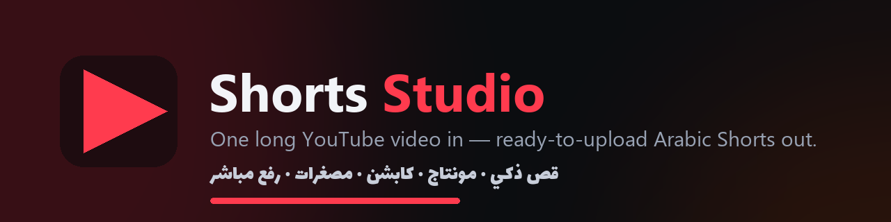
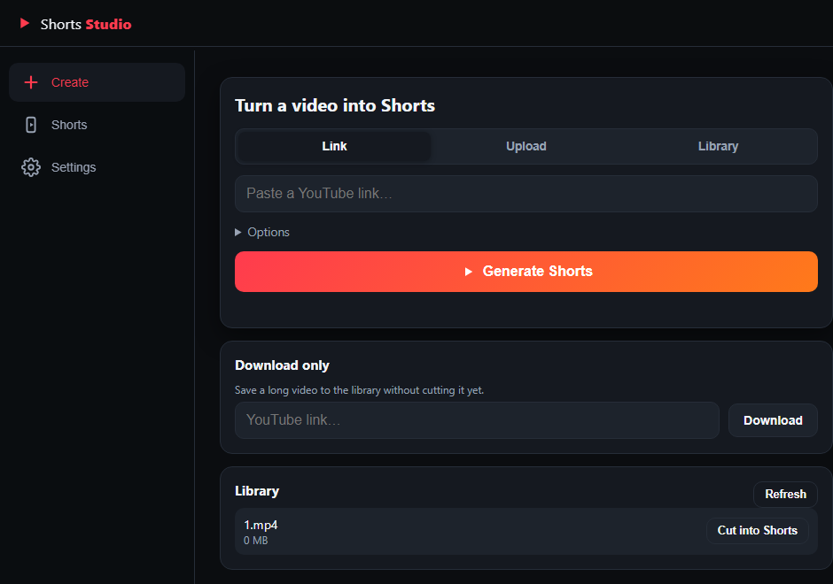
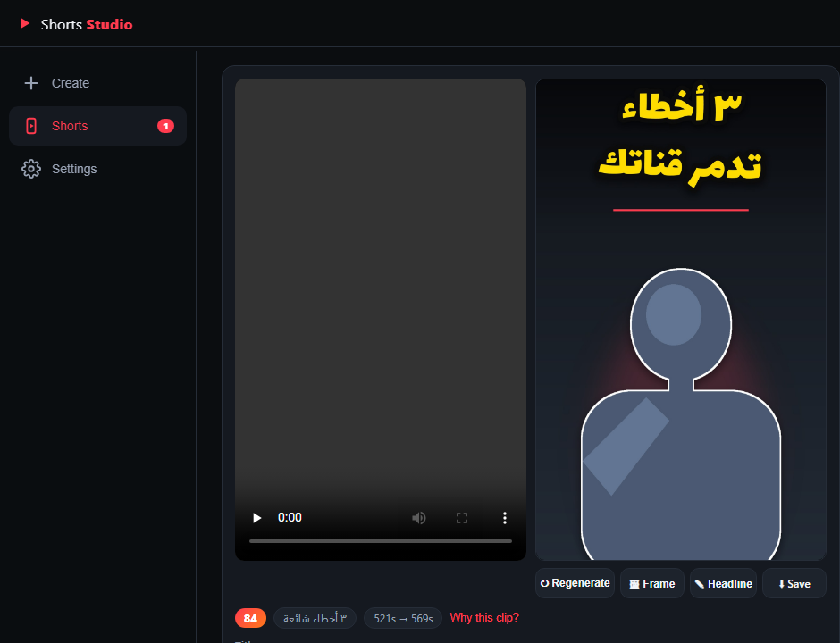
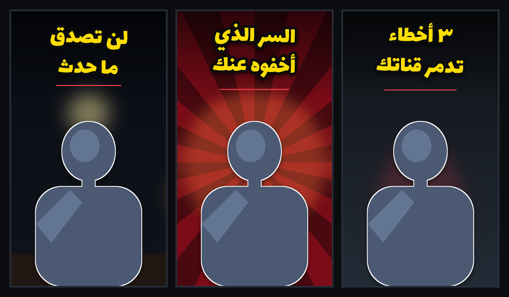
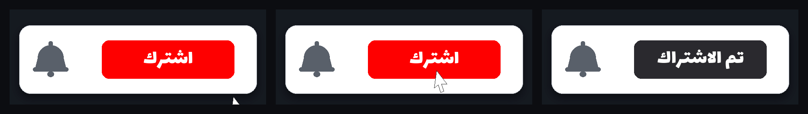
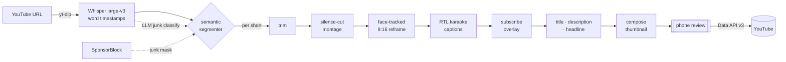

<p align="center">
  
</p>

<h1 align="center">YouTube Shorts Studio</h1>

<p align="center">
  <b>One long YouTube video in — several ready-to-upload Arabic Shorts out.</b><br>
  Semantically cut, montage-paced, captioned, thumbnailed, and uploaded —<br>
  all self-hosted on your own PC, all free, all driven from your phone.
</p>

<p align="center">
  
  
  
  
  
  
</p>

---

## What it does

Paste a YouTube link into a phone-friendly web page and the pipeline turns a long
video into a batch of polished Shorts — each one a *complete idea* that opens on a
hook and ends on its payoff, never a random mid-sentence cut.

| | |
|---|---|
| 🎯 **Semantic segment selection** | A local LLM reads a sentence-numbered transcript and returns *indices* (never timestamps) — every cut lands on a sentence boundary. Intros, sponsor reads and outros are masked out. |
| ✂️ **Silence-cut montage** | Dead air between words is removed with clean jump cuts and a subtle alternating punch-in zoom — that fast, addictive rhythm. Captions stay perfectly in sync. |
| 🗣️ **Egyptian-Arabic karaoke captions** | Word-by-word highlight with correct **right-to-left** layout (most tools scramble Arabic word order — this one positions every word itself). |
| 🔔 **Subscribe reminder** | An animated اشترك button with a bell "ding", generated programmatically and burned into every short. |
| 🖼️ **AI thumbnails** | The best face frame is auto-picked and cut out — the presenter's *real pixels*, never an AI face — on a bold background under a huge Arabic headline. |
| ✍️ **Auto copy** | Curiosity-driven title, description, hashtags and thumbnail headline, all from the local model. |
| 📤 **One-tap upload** | Review on your phone, then upload straight to YouTube (official Data API v3). |

<br>

<table>
  <tr>
    <td width="50%"></td>
    <td width="50%"></td>
  </tr>
  <tr>
    <td align="center"><b>Create</b> — paste a link, pick how many Shorts, generate</td>
    <td align="center"><b>Review</b> — edit copy, reshape the thumbnail, upload</td>
  </tr>
</table>

> **Note on the images.** The screenshots use synthetic, face-free demo data (a
> silhouette stands in for the presenter) — the real app composites your actual
> face from the video. Nothing here is a real person.

### AI thumbnails — three built-in styles

<p align="center"></p>
<p align="center"><i>blur · burst · flat — real face cutout + huge shaped-Arabic headline, 1080×1920, ready to publish</i></p>

### The subscribe reminder, frame by frame

<p align="center"></p>
<p align="center"><i>The pill slides in → a cursor clicks اشترك → it flips to تم الاشتراك with a bell chime — no stock footage, drawn in code.</i></p>

---

## How it works



**Why it's different from a naive clipper:** the LLM never guesses timestamps
(they're resolved from Whisper word timings in code), boundaries snap to whole
sentences, and "number of shorts" is a **maximum** — if only 3 of 5 requested
segments are genuinely strong, you get 3 and the UI tells you why. Quality over
padding.

**Runs on one 8 GB GPU** (RTX 3060 Ti class): Whisper, a 7B Arabic LLM and the
background-removal model are scheduled so they never fight for VRAM. No cloud, no
per-video SaaS fees.

---

## Quickstart

**Prerequisites:** Python 3.11+, `ffmpeg`/`ffprobe` on PATH,
[Ollama](https://ollama.com) with a model pulled — for Arabic content
**`ollama pull command-r7b-arabic`** gives the best results (Arabic-specialized,
fits 8 GB); `qwen2.5:7b` is a solid multilingual alternative. Optionally
`cloudflared` for phone access.

```bash
python -m venv .venv && . .venv/Scripts/activate   # Windows: .venv\Scripts\Activate.ps1
pip install -r requirements.txt -r requirements-studio.txt
# GPU transcription (NVIDIA):
pip install nvidia-cublas-cu12 nvidia-cudnn-cu12 nvidia-cuda-runtime-cu12 nvidia-cuda-nvrtc-cu12

cp studio.example.yaml studio.yaml    # then edit — SET A STRONG app_password
python -m studio.login_setup          # one-time YouTube OAuth (see guide)
python -m studio                      # prints a local + tunnel URL for your phone
```

Full setup (YouTube API credentials, tunnel modes, every config knob):
**[STUDIO_README.md](STUDIO_README.md)**.

**CLI tools (no upload):** `python -m studio.prepare --check` (environment
doctor) · `python -m studio.shorts <video-or-URL> --count 3` (batch to
`workspace/shorts/`) · `python -m studio.sample_modes <video>` (compare reframe
looks).

---

## Security posture

Built to sit on the public internet behind a tunnel:

- Password gate with per-install **HMAC cookies** and **serialized login backoff + lockout**
- **Fail-closed startup** — refuses to expose itself on a default/empty password
- Strict **CSP** + security headers; every state-changing endpoint is auth-gated
- **SSRF-guarded** downloads (host allowlist + private-IP blocking) and **upload size caps**
- **AES-256-GCM vault** for cloud API keys (DPAPI-wrapped on Windows); ACL-locked OAuth token
- No secrets in the repo — `secrets/`, `workspace/`, `studio.yaml` are gitignored

Every hardening decision went through a dedicated security review before
release. Read [the security notes](STUDIO_README.md#security-notes) before
exposing it.

## Repo layout

```
studio/             the app: server, pipeline, segmenter, montage, subscribe
                    overlay, thumbnails, captions, YouTube publisher, web UI
adaptive_reframe/   the standalone face-tracking 9:16 reframing engine
REDESIGN_PLAN.md    the architecture/design document this build followed
STUDIO_README.md    full deploy + usage guide
studio.example.yaml every configuration option
```

## Acknowledgements

[yt-dlp](https://github.com/yt-dlp/yt-dlp) · [faster-whisper](https://github.com/SYSTRAN/faster-whisper) · [Ollama](https://ollama.com) · [OpenCV](https://opencv.org) · [ffmpeg](https://ffmpeg.org) · [libass](https://github.com/libass/libass) · [rembg](https://github.com/danielgatis/rembg) · [SponsorBlock](https://sponsor.ajay.app) (CC BY-NC-SA 4.0 data) · [FastAPI](https://fastapi.tiangolo.com) · Google Fonts ([Cairo, Tajawal, Lalezar](studio/assets/fonts/README.md), OFL)

## License

[MIT](LICENSE). Only download / publish content you own or have the right to use.
